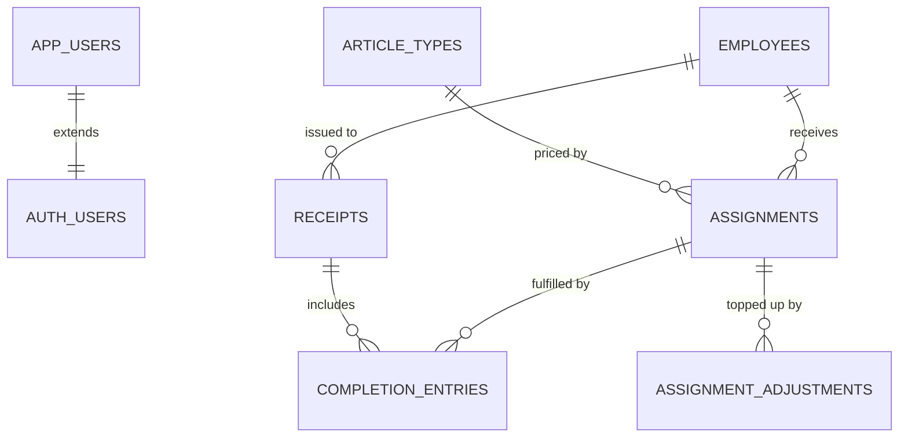
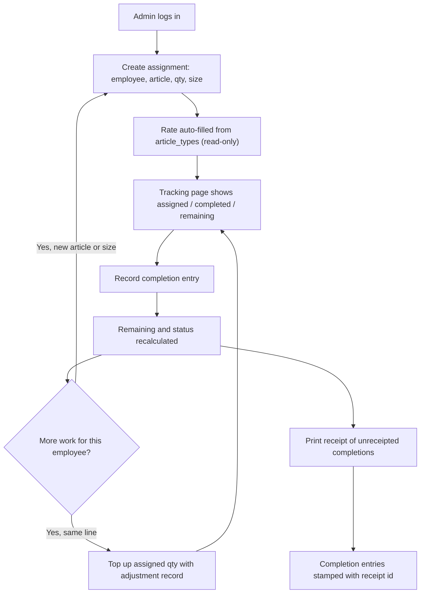

# Boutique Inventory System — Product Requirements Document

- **Version:** 0.2 (Draft)
- **Last updated:** 29 Aug 2026
- **Owner:** Product owner (boutique admin)
- **Status:** Approved scope for v1 build

---

## 1. Change Control

This document is the single source of truth for scope.

- Any new feature, or any change to an existing one, must be reflected here **before** implementation.
- The agent must **ask for explicit approval** before editing this file, and only apply the change once approval is given.
- Every approved change bumps the version number and is recorded in [Section 14: Changelog](#14-changelog).

---

## 2. Problem Statement

A boutique distributes cut fabric pieces to stitching employees (tailors) and currently tracks the handout, the returned finished pieces, and the pending balance on paper or memory. This causes:

- No reliable record of how many pieces each employee is holding at any moment.
- Disputes over how many pieces were handed in versus handed out.
- Stitching rates being applied inconsistently or from memory.
- No printable proof accompanying finished goods when they move to the next stage.

## 3. Goals and Non-Goals

### 3.1 Goals (v1)

1. Let an admin assign articles to a named employee with quantity, size, and an auto-filled stitching rate.
2. Show every assignment with a live view of assigned, completed, and remaining quantities.
3. Let the admin record completed pieces incrementally, with a full history of each hand-in.
4. Let the admin assign additional work to an employee who already has open work.
5. Produce a printable receipt of completed pieces for the next stage to verify quantities against.

### 3.2 Non-Goals (v1)

- Payroll, payment settlement, or wage disbursement tracking.
- Raw material / fabric stock management.
- Customer orders, sales, or billing.
- Employee-facing logins or a mobile app.
- Multi-branch or multi-boutique support.

## 4. Users and Roles

Authentication is Supabase Auth (email + password). All application routes are protected; unauthenticated visitors are redirected to `/login`. Each signed-in user has exactly one application role, stored in `app_users.role`.

| Capability | Admin | Super Admin |
| --- | --- | --- |
| Assign work (`/assign`) | ✓ | ✓ |
| Track progress and record completions (`/tracking`) | ✓ | ✓ |
| Top up open assignment lines | ✓ | ✓ |
| Reverse completion entries | ✓ | ✓ |
| Generate and re-print receipts | ✓ | ✓ |
| Manage employees (`/employees`) | ✓ | ✓ |
| View article catalogue and rates (`/articles`) | ✓ (read-only) | ✓ |
| Add new article types | — | ✓ |
| Edit stitching rates | — | ✓ |
| Deactivate / reactivate article types | — | ✓ |
| View platform users (`/users`) | — | ✓ |
| Create new Admin users (`/users`) | — | ✓ |
| Change another user's role (Admin ↔ Super Admin) | — | ✓ |

**Admin** — day-to-day boutique operations: hand out work, track returns, manage tailors, and issue receipts. Cannot change the article catalogue, pricing, or platform users from the app. Admins are created by a Super Admin from `/users`.

**Super Admin** — everything an Admin can do, plus full control of the article and price catalogue and platform user management. Rate changes apply only to **new** assignments; existing assignments keep the rate snapshotted at creation.

The first Super Admin is bootstrapped in the Supabase SQL Editor (see README). After that, Super Admins can create additional Admins and promote/demote roles from `/users`.

## 5. Core Concepts and Glossary

- **Employee** — a tailor who receives articles to stitch.
- **Article Type** — a garment category with a fixed stitching rate (e.g. Shirt, Trouser, Kurta). Rates live in the `article_types` table. Admins see them read-only; Super Admins can add and edit them from `/articles`. The assignment form always shows the rate as read-only.
- **Assignment** — one line of work: one employee, one article type, one size, a quantity assigned, and the stitching rate captured at the time of assignment.
- **Completion Entry** — a dated record of pieces handed back against a single assignment. An assignment can have many completion entries.
- **Remaining / In Progress** — `quantity_assigned − sum(completion entries)` for an assignment.
- **Receipt** — a printable slip listing completed pieces for one employee, used by the next stage to physically match quantities.

## 6. Functional Requirements

### 6.1 Assign Work (`/assign`)

The admin fills a single form to create an assignment.

**Fields**

| Field | Type | Rules |
| --- | --- | --- |
| Employee | Searchable select | Required. Picks an existing employee; inline "＋ New employee" creates one without leaving the page |
| Article | Searchable select | Required. Sourced from the Supabase article/price table |
| Quantity assigned | Integer input | Required. Must be ≥ 1 |
| Size | Dropdown | Required. One of `S`, `M`, `L`, `XL` |
| Stitching rate (₹) | Read-only display | Auto-filled from the selected article's price. Disabled input, never user-editable |
| Notes | Optional text | Free text, e.g. batch or lot reference |

**Behaviour**

- Selecting an article immediately populates the rate. Changing the article re-populates it. Size does **not** affect the rate.
- The form shows a live computed line value (`quantity × rate`) as a convenience for the admin. This is internal only and never appears on a receipt.
- On submit, the assignment is created with the rate stored as a snapshot on the row, so a later change to the price table does not rewrite historical assignments.
- After submit, the admin is shown a success state with a "Assign another" action.

**Validation and errors**

- Blocking errors are shown inline per field; the submit button is disabled until the form is valid.
- Duplicate detection: if the same employee already has an **open** assignment for the same article and size, the form warns and offers two paths — "Add as a new line" or "Top up the existing line" (see 6.3).

### 6.2 Tracking Page (`/tracking`)

The operational home screen. Lists all assignments with their progress.

**Layout**

- Rows are grouped by employee. Each employee group header shows the employee name plus rolled-up totals: total assigned, total completed, total remaining.
- Expanding a group shows its assignment lines.

**Per-line columns**

- Article
- Size
- Assigned
- Completed
- Remaining
- Status badge — `Not Started` (completed = 0), `In Progress` (0 < completed < assigned), `Completed` (completed = assigned)
- Assigned on (date)
- Actions — `Record Completion`, `View History`

**Filters and search**

- Search by employee name.
- Filter by status, article, and size.
- Default sort: most recently updated first.

**Empty state:** a prompt linking to `/assign`.

### 6.3 Recording Completions

Triggered from a line's `Record Completion` action; opens a dialog.

- Shows a read-only summary of the line: employee, article, size, assigned, already completed, remaining.
- Input: **Quantity completed now** (integer ≥ 1).
- Optional: completion date (defaults to today) and a note.
- **Hard rule:** the entered quantity may not exceed the remaining quantity. The input is capped and an inline error blocks submission.
- On save, a new completion entry is written. The line's completed total, remaining, and status recalculate immediately.
- `View History` shows every completion entry for that line with date, quantity, and note. Entries are append-only; corrections are made by an admin-only "reverse entry" that records a negative adjustment with a mandatory reason, preserving the audit trail.

### 6.4 Assigning More Work to an Existing Employee

Two supported paths, both reachable from the employee group header on `/tracking`:

1. **Assign new line** (default) — opens `/assign` prefilled with that employee. Used when the article or size differs, or when the admin wants the new batch tracked separately.
2. **Top up an existing line** — increases `quantity_assigned` on an open line for the same article and size. Every top-up writes an adjustment record (who, when, old value, new value, delta) so the assigned quantity is never silently changed.

Remaining is always recomputed from the current assigned quantity minus completions.

### 6.5 Print Receipt

Available from the employee group header on `/tracking` as a `Print Receipt` button.

**Scope:** one receipt covers **all completion entries for that employee that have not yet been included in a previous receipt**. This prevents the next stage from receiving the same pieces on two slips.

**Contents**

- Receipt number and generation date/time.
- Boutique name/header.
- Employee name.
- A table of lines, one per article + size combination: **Article name · Size · Number of pieces completed**.
- Total pieces on the receipt.
- Signature blocks for "Handed over by" and "Received by".

**Explicitly excluded:** stitching rate, line value, and any total amount payable. The receipt is a quantity-matching document only.

**Behaviour**

- Generating a receipt persists it and stamps the included completion entries with its ID, so they are excluded from future receipts.
- Opens a clean, print-optimised A5/A4 view and triggers the browser print dialog.
- A `/receipts` list allows re-printing any past receipt. Re-prints render the original stored snapshot, not recomputed data.
- If an employee has no unreceipted completions, the button is disabled with an explanatory tooltip.

### 6.6 Employee Management (`/employees`)

- List of employees with name, contact number (optional), status, and rolled-up open work.
- Create and edit an employee.
- Deactivate an employee — they disappear from new assignment dropdowns but all history is retained. Deactivation is blocked while the employee has remaining pieces, with a clear explanation.

### 6.7 Article and Price Catalogue (`/articles`)

Shared for both roles:

- Table columns: article name, stitching rate (₹), count of open assignment lines, and active/inactive status.
- Informational note: each assignment stores the rate that applied on the day it was created, so a later price change never rewrites past work.

**Admin (read-only)**

- The table and rates are view-only. No add, edit, or deactivate controls are shown.

**Super Admin (full catalogue management)**

- **Add article** — opens a dialog with:
  - **Name** (required, unique, 1–80 characters)
  - **Stitching rate (₹)** (required, numeric ≥ 0)
- **Edit article** — opens the same dialog pre-filled. Name and rate can both be changed.
- **Deactivate / reactivate** — toggles `is_active`. Deactivated articles disappear from the assignment dropdown but all history is retained. Deactivation is blocked while the article has open assignment lines (remaining quantity > 0), with a clear error message.
- New articles are immediately available on `/assign` for new assignments.

Because assignments snapshot the rate at creation, editing a rate only affects assignments created afterwards.

### 6.8 Platform User Management (`/users`, Super Admin only)

Super Admin screen for managing who can sign in to the application. Non–Super Admin users who open `/users` are redirected to `/tracking`.

**User list**

- Table columns: email, role (`Admin` / `Super Admin`), invited date (when applicable), last sign-in.
- The signed-in Super Admin's own row is marked and cannot be demoted.

**Add Admin**

- Super Admin enters:
  - **Email** (required)
  - **Password** (optional — if left blank, the system generates a random password)
- A confirmed Supabase Auth account is created with role `admin`.
- After creation, the app shows the email and password on screen so the Super Admin can copy and share them manually (e.g. Slack, WhatsApp). **No email is sent by the app.**
- The new user signs in at `/login` with those credentials. No separate sign-up screen.
- If the email address already belongs to an account, creation is rejected with a clear message.

**Change role**

- Super Admin can promote an Admin to Super Admin, or demote a Super Admin to Admin, via an inline role control.
- **Safeguards:**
  - A Super Admin cannot change their own role.
  - The last remaining Super Admin cannot be demoted.

**Bootstrap**

- The very first Super Admin is still created manually in SQL when the project is first set up. All subsequent Admins are created from the app.

## 7. Data Model

### 7.1 Tables

**`app_users`**

- `id` uuid, primary key, references `auth.users` on delete cascade
- `role` enum `app_role` — `admin` | `super_admin`, default `admin`
- `invited_by` uuid, nullable, references `auth.users` — set when a Super Admin creates the user from `/users`
- `invited_at` timestamptz, nullable — when the account was created from `/users`
- `created_at` timestamptz, default now()

A row is created automatically when a new Auth user is registered. Invited users are always created with role `admin`. The first Super Admin is assigned by updating this row in SQL.

**`employees`**

- `id` uuid, primary key
- `name` text, required
- `phone` text, nullable
- `is_active` boolean, default true
- `created_at` timestamptz, default now()

**`article_types`**

- `id` uuid, primary key
- `name` text, required, unique
- `stitching_price` numeric(10,2), required, must be ≥ 0
- `is_active` boolean, default true
- `created_at` timestamptz, default now()

**`assignments`**

- `id` uuid, primary key
- `employee_id` uuid, references `employees`
- `article_type_id` uuid, references `article_types`
- `size` enum `size_t` — `S` | `M` | `L` | `XL`
- `quantity_assigned` integer, must be ≥ 1
- `unit_price` numeric(10,2), snapshot of the article rate at creation
- `notes` text, nullable
- `created_at`, `updated_at` timestamptz

**`completion_entries`**

- `id` uuid, primary key
- `assignment_id` uuid, references `assignments`
- `quantity` integer, must be ≠ 0 (negative only for admin reversals)
- `completed_on` date, default today
- `note` text, nullable
- `receipt_id` uuid, nullable, references `receipts`
- `created_at` timestamptz

**`assignment_adjustments`**

- `id` uuid, primary key
- `assignment_id` uuid, references `assignments`
- `previous_quantity` integer
- `new_quantity` integer
- `reason` text, nullable
- `created_at` timestamptz

**`receipts`**

- `id` uuid, primary key
- `receipt_no` text, unique, human-readable sequential number
- `employee_id` uuid, references `employees`
- `snapshot` jsonb — frozen line data (employee name, article names, sizes, quantities) for faithful re-printing
- `total_pieces` integer
- `created_at` timestamptz

### 7.2 Derived Values

Exposed through a database view so the client never recomputes them inconsistently:

- `completed_quantity` = `SUM(completion_entries.quantity)` for the assignment, defaulting to 0
- `remaining_quantity` = `quantity_assigned − completed_quantity`
- `status` = `Not Started` | `In Progress` | `Completed`

### 7.3 Integrity Rules

- Database-level check constraints on all quantity fields.
- A trigger or transactional check prevents total completions from exceeding `quantity_assigned`.
- Row Level Security enabled on every table.
- Operational tables (`employees`, `assignments`, `completion_entries`, `assignment_adjustments`, `receipts`) grant full access to any authenticated user with a role (`admin` or `super_admin`).
- `article_types`: `select` for all authenticated users; `insert` and `update` only when `app_users.role = super_admin`.
- `app_users`: each user may `select` their own row; Super Admins may `select` all rows and `update` any row's `role` (subject to app-level safeguards). Creating users uses the Supabase service-role key on the server only.
- Indexes on `assignments.employee_id`, `assignments.article_type_id`, `completion_entries.assignment_id`, and `completion_entries.receipt_id`.

## 8. Key Flows

## 9. Technical Approach

- **Framework:** Next.js (App Router) with TypeScript.
- **UI:** Tailwind CSS with shadcn/ui components.
- **Backend and database:** Supabase (Postgres, Auth, RLS).
- **Data access:** Supabase server client inside Server Components and Server Actions for all mutations. No service-role key is ever exposed to the browser.
- **Roles:** resolved server-side from `app_users` on each request. Server actions that mutate `article_types` or platform users verify Super Admin before calling Supabase; RLS enforces the same rule as a backstop.
- **User creation:** the Supabase **service-role key** is a server-only environment variable, used only when a Super Admin creates an account from `/users`. It is never exposed to the browser.
- **Validation:** Zod schemas shared between client form validation and server actions; the database enforces the same rules as a final backstop.
- **Printing:** a dedicated print route rendered server-side with a print-only stylesheet, avoiding a PDF dependency in v1.

### 9.1 Proposed Routes

- `/login` — Supabase Auth sign-in
- `/` — redirects to `/tracking`
- `/assign` — assignment form
- `/tracking` — assignments, progress, completions, receipt generation
- `/employees` — employee list and management
- `/articles` — article catalogue (read-only for Admin; full management for Super Admin)
- `/users` — platform user list, create admins, role management (Super Admin only)
- `/receipts` — receipt history
- `/receipts/[id]/print` — printable receipt view

## 10. Non-Functional Requirements

- **Usability:** the assignment form must be completable in under 30 seconds by a non-technical user; primary actions reachable in at most two clicks from `/tracking`.
- **Responsiveness:** usable on a tablet and a laptop; the tracking table degrades to stacked cards on narrow screens.
- **Correctness:** quantity arithmetic must never allow completed to exceed assigned, and must never double-count pieces across receipts.
- **Performance:** tracking page loads within 2 seconds for up to 5,000 assignment lines, using server-side pagination.
- **Auditability:** completions, adjustments, and receipts are append-only records.
- **Localisation:** currency displayed as Indian Rupees (₹) with thousands separators; dates in `DD MMM YYYY`.

## 11. Success Metrics

- Admin can assign, track, and receipt work without paper records.
- Zero instances of remaining quantity going negative.
- Zero duplicate pieces appearing across two receipts.
- Next-stage quantity mismatches reduced to near zero.

## 12. Release Plan

**Phase 1 — Foundation**
Supabase project, schema, RLS, seed article rates, Next.js scaffold, admin auth.

**Phase 2 — Assignment**
Employee management, assignment form with auto-filled read-only rate.

**Phase 3 — Tracking**
Grouped tracking page, completion entries, derived remaining and status, top-up flow.

**Phase 4 — Receipts**
Receipt generation, unreceipted-completion scoping, print view, receipt history.

## 13. Open Questions

1. Should the boutique name, address, and logo on the receipt be hardcoded for v1 or configurable in a settings table?
2. What format should the receipt number follow (e.g. `RCP-2026-0001`)?
3. Should the tracking page expose a date range filter for reporting, or is search plus status filtering sufficient for v1?
4. Should assignments have an expected due date so overdue work can be flagged?

## 14. Changelog

| Version | Date | Change |
| --- | --- | --- |
| 0.4 | 29 Aug 2026 | Removed email invites; Super Admin creates admins with email + password (optional auto-generate) and shares credentials manually |
| 0.3 | 29 Aug 2026 | Super Admin user management: invite Admins by email (credentials + login link via Resend), list users, change roles; `/users` route |
| 0.2 | 29 Aug 2026 | Super Admin role: full article catalogue management (add, edit rates, deactivate); Admin retains read-only catalogue access and all operational features |
| 0.1 | 27 Aug 2026 | Initial PRD: assignment, tracking with incremental completions, top-up mechanism, and quantity-only print receipt |
